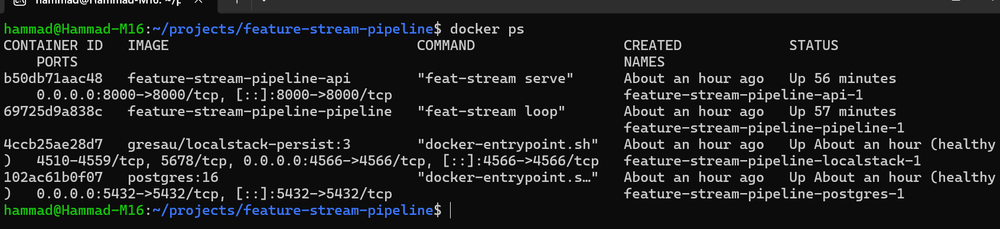
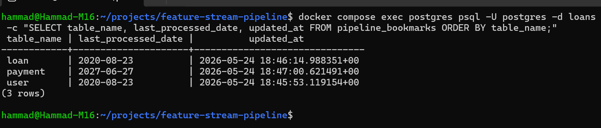
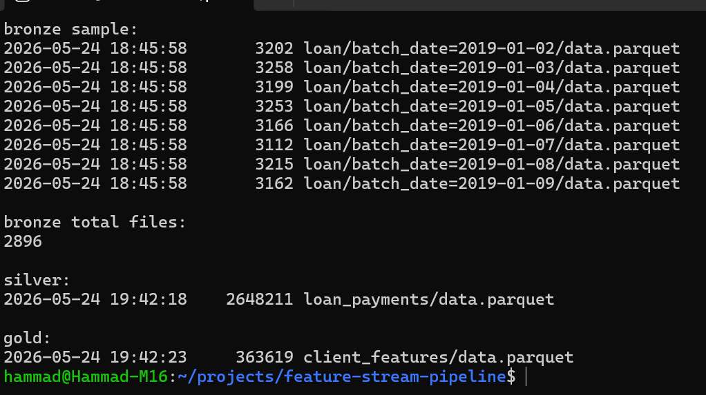
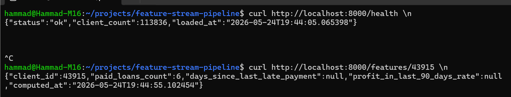
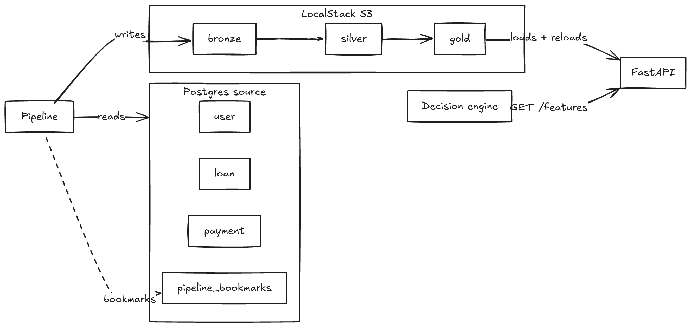

# feature-stream-pipeline

This repo shows the development of a polling-based data pipeline that ingests changes from a loan-issuance Postgres source into a feature store, and serves per-client features over HTTP for a credit decision engine.

The source schema has three tables (`user`, `loan`, `payment`) with day-level granularity. I poll each table for new dates since its last bookmark (watermark), write per-day Parquet files to a bronze layer, join loans and payments into a silver dataset, compute three client-level features into gold, and serve gold via FastAPI.

S3 is LocalStack with persistence (`gresau/localstack-persist`), so the same boto3 and pyarrow code runs unchanged against real AWS S3.


## 1. Tech Stack

- Language: Python 3.12 with `uv` for dependency management
- Source: Postgres 16
- Storage: LocalStack S3 via `gresau/localstack-persist` for cross-restart persistence
- Data: Polars for transformations, pyarrow for Parquet and S3 streaming, boto3 for S3 metadata
- Serving: FastAPI with Pydantic schema contracts
- Tests: pytest
- Orchestration: Docker Compose, typer CLI


## 2. Run

### 2.1. Prerequisites:

- Docker and Docker Compose (tested on Docker 24+, Compose v2)
- The Postgres dump file at `data/de_test_task_db`. Provided in this repo.

### 2.2. First run:

```bash
docker compose up -d
```

This brings up four services: Postgres, LocalStack S3, the pipeline, and the API. First run takes 5 to 10 minutes because:

- Postgres restores the dump (around 2 minutes)
- LocalStack initialises the bronze/silver/gold buckets
- The pipeline runs its first ingestion cycle and writes 2,896 Parquet files across the bronze layer

Subsequent restarts are fast because Postgres and LocalStack persist their data in Docker volumes.

### 2.3. Verifying the stack is up:

Have to wait until Postgres and LocalStack show `(healthy)`. Check through:

```bash
docker compose ps
```

### 2.4. API usage:

```bash
curl http://localhost:8000/health
curl http://localhost:8000/features/43915
```

Health returns the current count of clients in memory and the timestamp that the gold layer was loaded. Features returns the three computed features for that specific client_id.

### 2.5. The pipeline

The pipeline runs a cycle every `POLL_INTERVAL_SECONDS` (default set to 30). One log line per cycle can be seen through:

```bash
docker compose logs -f pipeline
```

### 2.6. Stopping:

```bash
docker compose down       # stops services, keeps Postgres and S3 data
docker compose down -v    # stops services, wipes the volumes (full reset)
```

## 3. Verification

System logs screenshots after a fresh `docker compose up`.

### 3.1. All services up:



### 3.2. Bookmarks in Postgres:

The `payment` table's bookmark sits at 2027-06-27, the latest date in the source (which extends into the future, see section 6. Data Observations). `user` and `loan` bookmarks sit at 2020-08-23, the actual end of real source activity.



### 3.3. S3 layers

Bronze holds 2,896 per-day Parquet files, partitioned by table and date. Silver holds the joined loan + payment dataset as a single Parquet under the `loan_payments/` prefix. Gold holds the per-client features as a single Parquet under the `client_features/` prefix.



### 3.4. API responding:

Health endpoint reports current count and the timestamp the in-memory dict was last loaded. Features endpoint returns the JSON the decision engine would consume.




## 4. Architecture

### 4.1. Architecture diagram:

How the four processes fit together. Pipeline reads from Postgres, writes the bronze, silver, gold layers to S3. Pipeline bookmarks live in Postgres for crash-safety. The API reads gold into memory at startup and reloads it every 30 seconds. Decision engine queries the API.



### 4.2. The layers, in order:

**Bronze.** I write raw source rows to S3 as Parquet, partitioned by date. One file per source date per table. Filename pattern: `s3://bronze/{table}/batch_date=YYYY-MM-DD/data.parquet`. Bronze is incremental. Each table has a bookmark in `pipeline_bookmarks` (a Postgres table) that records the highest source date I've already written. Each pipeline cycle reads only dates strictly after the bookmark.

**Silver.** A LEFT JOIN of loan and payment on `loan_id`, written as a single Parquet at `s3://silver/loan_payments/data.parquet`. Loans without payments appear with NULL payment columns. Silver is rebuilt fully on every cycle (no bookmark) because joined state changes whenever either side moves.

**Gold.** One row per client from the user table, with the three computed features and a `computed_at` timestamp. Single Parquet at `s3://gold/client_features/data.parquet`. Every known client gets a row, including clients with no loans (their feature values are 0 or NULL depending on the feature). Gold is a single Parquet file, which means data scientists can also load it directly for ML training. One call (`pl.read_parquet(...)` or pandas equivalent), and they can get all features for all clients. Same file works for both the real-time API and offline analysis.

**API.** A FastAPI service that loads gold into memory at startup and serves `GET /features/{client_id}`. The in-memory copy is sized for a 113k-client dataset. For larger feature stores I'd back it with Redis or DynamoDB. Feature lookup by client_id is just a dict lookup. So getting features back for one client is microseconds. A POST /reload endpoint also exists for reloading.

The pipeline orchestrator runs bronze, then silver, then gold in sequence, then sleeps `POLL_INTERVAL_SECONDS`, repeats. The dict mentioned in the `API` refreshes in the background every `POLL_INTERVAL_SECONDS`, so the API stays current with gold. The /reload endpoint can also be hit manually to force an immediate refresh. Reload happens atomically. Also, concurrent requests see either the old dict or the new dict, never a half-loaded state.


## 5. Data and Features

### 5.1. Source Schema:

| Table | Key columns | Purpose | Row count |
|---|---|---|---|
| `user` | `id`, `created_on` | One row per customer | 113,836 |
| `loan` | `id`, `client_id`, `amount`, `status`, `created_on`, `updated_on`, `matured_on`, `duration` | One row per loan application or issued loan | 167,213 |
| `payment` | `id`, `loan_id`, `amount`, `principle`, `interest`, `status`, `created_on` | One row per payment (real or scheduled) | 118,332 |

`loan.client_id` is a foreign key to `user.id`. `payment.loan_id` is a foreign key to `loan.id`. Loan statuses: `application`, `active`, `paid`, `overdue`. Payment statuses: `on_time`, `late`.

### 5.2. Features:

Three features, computed in `feat_stream/features/compute.py`.

**`paid_loans_count`** (int, never NULL)
COUNT of loans with `status = 'paid'`, per client. Clients with no loans get 0. I have not counted loans in `application` status because they're not actually issued.

**`days_since_last_late_payment`** (int, nullable)
For each client, I find the max `payment.created_on` where `payment.status = 'late'` and `payment.created_on <= today`, then take today minus that date in days. NULL if the client has never had a late payment. Added the `<= today` filter to exclude future-scheduled payment rows because around 16% of the payment table is future-dated in the source dump (more on this in Data observations section below).

**`profit_in_last_90_days_rate`** (float, nullable)
Sum of `payment.interest` divided by sum of `loan.amount`, for loans where `loan.created_on` is within the last 90 days AND `loan.status IN ('active', 'paid', 'overdue')` AND any joined `payment.created_on <= today`. NULL if the client has no qualifying loans. On the used data, this feature is NULL for every client because the source data ends on 2020-08-23 and today is well past that. I validated the math by back-dating today to 2020-08-23. With that override, 22,168 clients get a non-NULL rate, the mean is 0.1009, and client_id 43915 returns 0.2141 in both Polars and direct Postgres aggregation.

### 5.3. Adding a New Feature:

This would be short work. Need to write a function in `feat_stream/features/compute.py`, add a join for it in `build_gold`, add a field to the Pydantic model, add a test. The compute module is small functions that take a DataFrame and return a DataFrame, so this stays the same shape no matter how many features get added.


## 6. Data Observations

A few things that were observed about the dataset that affected my feature logic.

**Every loan has 0 or 1 payment record:** I expected an installment pattern (one payment row per scheduled installment). What was found instead was that every loan that has any payments has exactly one payment. The single payment record represents the loan's settlement event. The features still compute correctly with this shape, but the math will look different against a more granular dataset with multi-installment payments.

**About 16% of payments are future-dated:** Payment dates extend to 2027-06-27 because of scheduled-payment rows, i.e. Around 19,000 payment rows have `created_on` past today. I read through the Mambu docs (a major cloud lending platform used by e.g. N26,etc.) and found this pattern documented explicitly. Apparently, lending platforms materialize the repayment schedule at loan issuance, creating payment rows in advance with the expected due dates, then update them when the actual payment arrives (https://docs.mambu.com/docs/processing-loan-repayments/). That matches what I see here in the used data. So I filter `payment.created_on <= today` in features 2 and 3 to keep only payments that actually happened. Without this filter, days_since_last_late_payment could be negative.

**Status distribution:** Loans: roughly 40% application (never converted), 10% active, 40% paid, 10% overdue. Payments: roughly 94% on time, 6% late. The bias toward on-time payments is normal for a functioning consumer lender.

**Client population:** 113,836 distinct users in source. 45,533 have at least one paid loan. 6,945 have at least one late payment. Roughly 60% have never had a loan funded past application stage.

**Schema observations:**
- `user` is a SQL reserved word in Postgres, so any query against it needs `"user"` in double quotes.
- Loan dates can have all-NULL `matured_on` on days where every loan was an application (not yet funded). I handle this in bronze ingestion via `pl.concat(diagonal_relaxed)` which tolerates per-file schema drift.


## 7. Design Decisions

### 7.1. Polling instead of Log-based CDC:

The columns I poll (`user.created_on`, `loan.updated_on`, `payment.created_on`) are `DATE`, not `TIMESTAMPTZ`. So the source itself only knows about days, not seconds. Log-based Change Data Capture (CDC) tools like Debezium and WAL streaming give sub-second event timestamps, but that is not needed here since the data used is daily.

Polling with a `last_processed_date` bookmark per table matches the source granularity. This way, for this case this solution is operationally simple and does not need tools like Kafka, Debezium, or any schema registry.

Calling this CDC, even though some people say this isn't CDC (https://thedataforge.medium.com/change-data-capture-cdc-real-time-ingestion-patterns-that-actually-work-bcb6e4925886) because polling can't catch deletes or out-of-order updates. They're right about both. But the source here uses DATE columns and doesn't track deletes anyway, so neither matters for this case.

### 7.2. Medallion Layout: Bronze-silver-gold Layering:

Went with three layers so that each one would be independently reprocessable from the layer below. Bronze keeps raw immutable copies of source state (easy to debug, easy to reprocess). Silver does the integration work (the join) once, so multiple downstream features can read it without redoing the same join. Gold is consumer-shaped output.

For this case, the layers are all in LocalStack S3. At production scale, they would be the same shape backed by real AWS S3.

### 7.3. Watermarks/Bookmarks in Postgres:

`pipeline_bookmarks` is a Postgres table I created with `(table_name, last_processed_date, updated_at)`. Bronze ingestion reads the bookmark (watermark), writes the day's Parquet, then advances the bookmark. Writing Parquet first then advancing the bookmark means a crash mid-write leaves the bookmark at the prior day, and the next run reprocesses that day. That's idempotent because S3 PUT to the same key overwrites.

Additionally, considered a JSON file on S3 instead. Went with Postgres for transactional UPSERT semantics and to avoid two workers writing the same file at the same time.

### 7.4. S3 client (localstack-persist + pyarrow.fs + boto3):

**LocalStack instead of MinIO.** I picked LocalStack because it runs the actual AWS S3 API. boto3 and pyarrow.fs code that targets LocalStack works against real AWS S3 with only an endpoint URL change. MinIO is S3-compatible but not S3-identical, and the migration path is less clean for the AWS-shop case. LocalStack's own comparison of S3 mocking tools makes the same distinction directly. They said thhat MinIO is "a production-grade object storage solution," while LocalStack is positioned as the option for testing applications before deploying to AWS, on the grounds of API parity (https://blog.localstack.cloud/2024-04-08-exploring-s3-mocking-tools-a-comparative-analysis-of-s3mock-minio-and-localstack/).

**localstack-persist instead of plain LocalStack.** LocalStack Community Edition does not persist S3 across container restarts (persistence is a Pro feature). I found `gresau/localstack-persist` (https://github.com/GREsau/localstack-persist), a community fork that adds persistence specifically for S3 (one of their tested services) while keeping the AWS API surface. Had to make the decision to use a third-party image dependency in return for any user being able to restart the stack and see the same state.

**pyarrow.fs.S3FileSystem for streaming writes, boto3 for listing.** I started with Polars' direct S3 writer (via the Rust `object_store` crate) and got blocked. It sends a `CRC64NVME` checksum on multipart uploads, which is the new AWS-SDK default but is not yet supported by LocalStack 3.x. Had to switch to pyarrow's S3 client, which uses the AWS SDK for C++ and handles checksum negotiation cleanly. For S3 listing, I use boto3 as it's the more direct choice.

### 7.5. Per-entity Feature Rows:

Every `client_id` in the user table gets a row in gold, with feature values filled or NULL depending on the feature. A brand-new client (no loan history yet) has `paid_loans_count=0`, `days_since_last_late_payment=NULL`, `profit_in_last_90_days_rate=NULL`.

I followed the Feast credit scoring tutorial's pattern (https://docs.feast.dev/tutorials/tutorials-overview/real-time-credit-scoring-on-aws). Credit decision engines need predictable shape with missing values explicit. The alternative (only emit rows for clients with loans) forces the consumer to handle two failure modes. One would be that "client not in feature store" and the second would be that "client present but features incomplete." This is why, doing per-entity emission collapses them to one.

### 7.6. Pydantic Schemas on the Feature Contract:

`ClientFeatures` in `feat_stream/features/schema.py` defines the gold schema as a Pydantic model. The FastAPI service uses it as the response model, so the JSON shape is enforced at the boundary. Pydantic also raises a `ValidationError` if gold data on disk has a wrong type, which means schema drift fails loud at API startup rather than silently downstream.


## 8. Tradeoffs/What I wouldd do Differently

Some choices I would revisit with more time.

**No structured logging.** The pipeline service prints one dict per cycle via `print()`. For production I would switch to `structlog` with JSON output ggoing to the log aggregation system in use, for example, CloudWatch, Datadog, ELK, etc. This would not be a complex integration, but it's not implemented here.


**Gold is rebuilt fully every cycle.** I read silver, join clients, compute three features, write gold. At 113k clients of the used dataset, this only takes a few seconds. But at a scale of Millions of clients, it would not. In that case, I would either compute features incrementally (only for clients whose loans changed since last cycle) or partition gold by client_id ranges.


**API uses in-memory dict for the online store.** This works for the dataset I'm using here. However, for multi-instance deployments or to scale for more than a single server's memory, I would switch to Redis or DynamoDB as the online store with a separate materialization step. This would match the AWS reference architecture for credit scoring feature stores I researched (https://aws.amazon.com/blogs/database/build-an-ultra-low-latency-online-feature-store-for-real-time-inferencing-using-amazon-elasticache-for-redis/).


**No warehouse loading.** The Gold layer is a Parquet file in S3. Data scientists can read it directly with `pl.read_parquet(...)` or pandas. However, if features needed to be queryable via SQL at scale ( for example for analyst dashboards or complex joins with other tables), then I would add a step to load gold into a warehouse table (Snowflake, Redshift, or Postgres).


**Slowly changing dimensions: Type 1 only.** Gold overwrites each cycle, so there's no record of how a client's features looked yesterday vs today. Fine for the decision engine's "current state" lookup pattern. Not fine for ML model training or regulatory audits, both of which need point-in-time feature values. I've seen the same requirement in the iGaming industry, where regulators want exact player state as-of specific moments for license compliance. Production would keep Type 2 history in the offline store (gold with effective_from/effective_to timestamps) while the online store stays Type 1. Feast handles this split natively. I scoped to Type 1 because the current features are all "as of now" semantics.


**No explicit retries when S3 writes fail.** If pyarrow fails to write a Parquet file to S3 due to for example a timeout or outage, the pipeline raises an exception and the cycle stops there. The bookmark doesn't advance, so the next cycle (30 seconds later) retries that day's work and usually succeeds. This implicit retry is fine for batch work, but not for systems with tight latency requirements where 30 seconds of delay matters. A production version would add explicit retries with exponential backoff around the upload call.


**No automated data quality checks.** The pipeline trusts that each layer's output is correct. There are no automated assertions like "silver should have roughly the same loan count as bronze" or "gold should have unique client_id values." If a bug introduced duplicate rows or dropped data, the pipeline wouldn't notice. In production I would use tools like Great Expectations or pandera to define these checks and fail the cycle if any assertion breaks. This is the kind of validation work I have production experience with in a data warehouse, where every model has incremental validation checks that gate the delivery layer.


**Feature design ambiguities I noticed.** Some of the features as specified have edge cases where the output number is the same but the real-world situation behind it is very different. Five examples below. Each one lists the feature, the ambiguous value, what it could mean, and what additional feature would resolve it.

- **`paid_loans_count = 0`.** This value can come from two very different clients. One has never taken a loan at all (no history). The other has taken loans but hasn't paid any back yet (likely bad signal). The decision engine sees the same `0` for both. To disambiguate, the feature store would also need a `total_loans_ever_taken` feature, which we haven't computed yet.

- **`days_since_last_late_payment = NULL`.** NULL here can mean two opposite things. One client has never made any payment yet (zero history). Another has made many payments and never been late (clean track record). Both look identical in the feature. A paired `total_payments_on_time` count would tell them apart.

- **`profit_in_last_90_days_rate = NULL`.** NULL means "no qualifying loans in the last 90 days," but the reason could be three different things. One could be that the client is new and hasn't borrowed yet, the second could be that the client used to borrow but stopped recently, and the third could be that the client has loans in `application` status that haven't been funded yet. Pairing with `days_since_last_loan_taken` and `total_loans_ever_taken` would let the decision engine tell these apart.

- **`profit_in_last_90_days_rate = 0.0`.** A rate of 0% looks like "this client generates no profit" but can also mean "the loan was just funded and no interest has been received yet." Splitting this into two separate features, `sum_interest_last_90_days` and `sum_loan_amount_last_90_days`, would let the consumer decide whether a 0 means "no interest yet" or "loan paid back with no profit."

- **`The 90-day window`.** This works fine for short loans (30 days) since the loan starts and ends within the window. For longer loans (6 months or more), 90 days only covers the early part. Most interest gets paid near the end of a loan, so a long loan that's just started shows almost no interest yet. The rate ends up low simply because the loan isn't done, not because the client is unprofitable.

These are feature design concerns, not implementation bugs. I would flag them in any feature review with the risk/product team.

## 9. Debugging Notes

A few blockers/challenges faced during development:

**Polars direct S3 write rejected by LocalStack:** Initially started by using `df.write_parquet('s3://...')`. Polars passes that to the Rust `object_store` crate, which started sending a `CRC64NVME` checksum on multipart uploads (new AWS SDK default). LocalStack 3.x doesn't accept it. After trying a few unsuccessful things with storage_options, switched the S3 write path to `pyarrow.fs.S3FileSystem`, which uses the AWS SDK for C++ and handles checksum negotiation cleanly. Same code now would run against real AWS S3 without changes.


**LocalStack silently dropping writes past around 1000 files per prefix:** First full ingestion claimed all 1,696 payment dates succeeded but only 1,000 Parquet files landed in S3. No error from pyarrow, no error in LocalStack logs. Spent time confirming this wasn't a pagination issue in `list_objects_v2`. Eventually traced it to a known issue in the LocalStack 3.x v3 S3 provider with high-volume small-file writes. Their 3.0 release notes document `PROVIDER_OVERRIDE_S3=legacy_v2` as the supported fallback (https://github.com/localstack/localstack/releases/tag/v3.0.0). Just a change of one env variable added, and now all 2,896 files now land correctly.


**LocalStack Community Edition doesn't persist S3 across container restarts:** After the first restart during development, all bronze data was gone. Persistence is a Pro-only feature in upstream LocalStack. Considered switching to MinIO but that loses the AWS API parity advantage I want. Found `gresau/localstack-persist`, a community fork that adds S3 persistence to LocalStack Community version while keeping the AWS API surface. Was just an image replacement and one volume mount for making the persistence work.


**Bronze files had inconsistent schemas across days:** Reading all 600 daily loan Parquet files at once caused pyarrow to crash with a casting error. On days where every loan was still in `application` status, the `matured_on` column was all NULL. pyarrow read those files and inferred the column type as `null` instead of `date`. On normal days with funded loans, the column was correctly typed as `date`. When combining all files into one frame, pyarrow couldn't reconcile the two types. The Fix was to use `pl.concat(frames, how='diagonal_relaxed')`, which tells Polars to expect schema differences and pick a common type.


**Postgres healthcheck stuck unhealthy after rebuild:** I added a named Docker volume so Postgres data would persist across container restarts. After that, every `docker compose up` showed Postgres as unhealthy. Checking the logs, the healthcheck was running `SELECT COUNT(*) FROM pipeline_bookmarks`, but the table didn't exist. The init scripts hadn't run. The reason was that Postgres only runs init scripts on a fresh data directory. The named volume already had data in it, so init was skipped. There were two ways to fix this. Either do `docker compose down -v` to wipe the volume on every rebuild, or give the healthcheck more time to wait for the dump restore. I went with the second one and set `start_period: 180s`.


**Future-dated payment rows:** About 19,000 rows in the payment table (16% of the total) had `created_on` dates in the future, going out to 2027. If I left them in the dataset, `days_since_last_late_payment` would come back negative (today minus a future date). Researching this in lending domain documentation, I found this matches a common platform pattern, that when a loan is issued, the system creates the expected payment rows in advance with the future due dates. The actual amount and status get filled in later, once the customer pays. Mambu, a cloud lending platform used by N26 and others, documents this exact behavior (https://docs.mambu.com/docs/processing-loan-repayments/). So the future-dated rows are placeholders, not real events. I filterered `payment.created_on <= today` in features 2 and 3 to keep only payments that actually happened.

## 10. Tests

Run the test suite inside the pipeline container:

````bash
docker compose run --rm pipeline pytest -v
````

There are 14 tests in total. 10 are for feature math, 4 are for bookmark behavior.

Feature tests build small DataFrames in memory and check the math directly. No Postgres or S3 needed. They cover normal cases and edge cases like status filtering, future-dated payments, loans without payments, and loans outside the 90-day window.

Bookmark tests use the running Postgres container. A pytest fixture wipes the `pipeline_bookmarks` table before and after each test, so running the suite will reset the bookmarks. Have to Re-run `feat-stream run` afterwards to repopulate.

I also cross-checked the math against Postgres directly during development. `paid_loans_count` matched a SQL count of distinct clients with paid loans, `days_since_last_late_payment` matched a SQL count of clients with at least one late payment, and `profit_in_last_90_days_rate` matched both the aggregate mean and per-client values when "today" was back-dated to the source data range.


## 11. Project Layout
```
├── docker-compose.yml
├── Dockerfile
├── pyproject.toml
├── data/de_test_task_db
├── localstack/init_buckets.sh
├── sql/
│   ├── restore.sh
│   └── init_bookmarks.sql
├── src/feat_stream/
│   ├── config.py
│   ├── db/postgres.py
│   ├── storage/s3.py
│   ├── state/bookmarks.py
│   ├── ingestion/
│   │   ├── bronze.py
│   │   └── silver.py
│   ├── features/
│   │   ├── compute.py
│   │   └── schema.py
│   ├── api/main.py
│   ├── pipeline.py
│   └── cli.py
└── tests/
    ├── test_features.py
    └── test_bookmarks.py
```